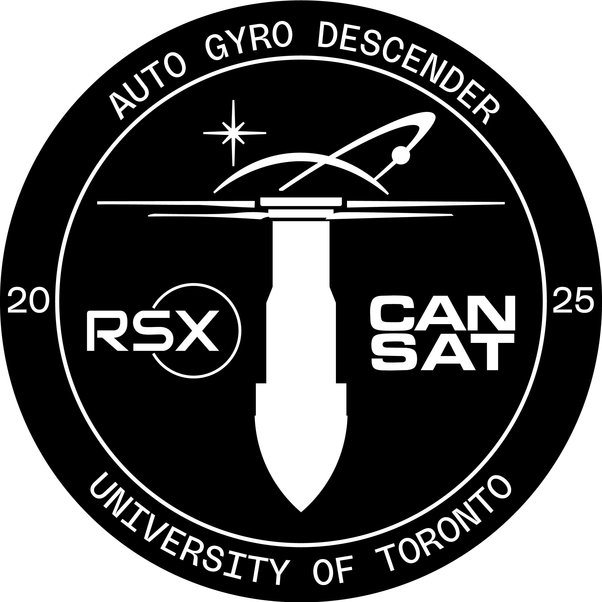
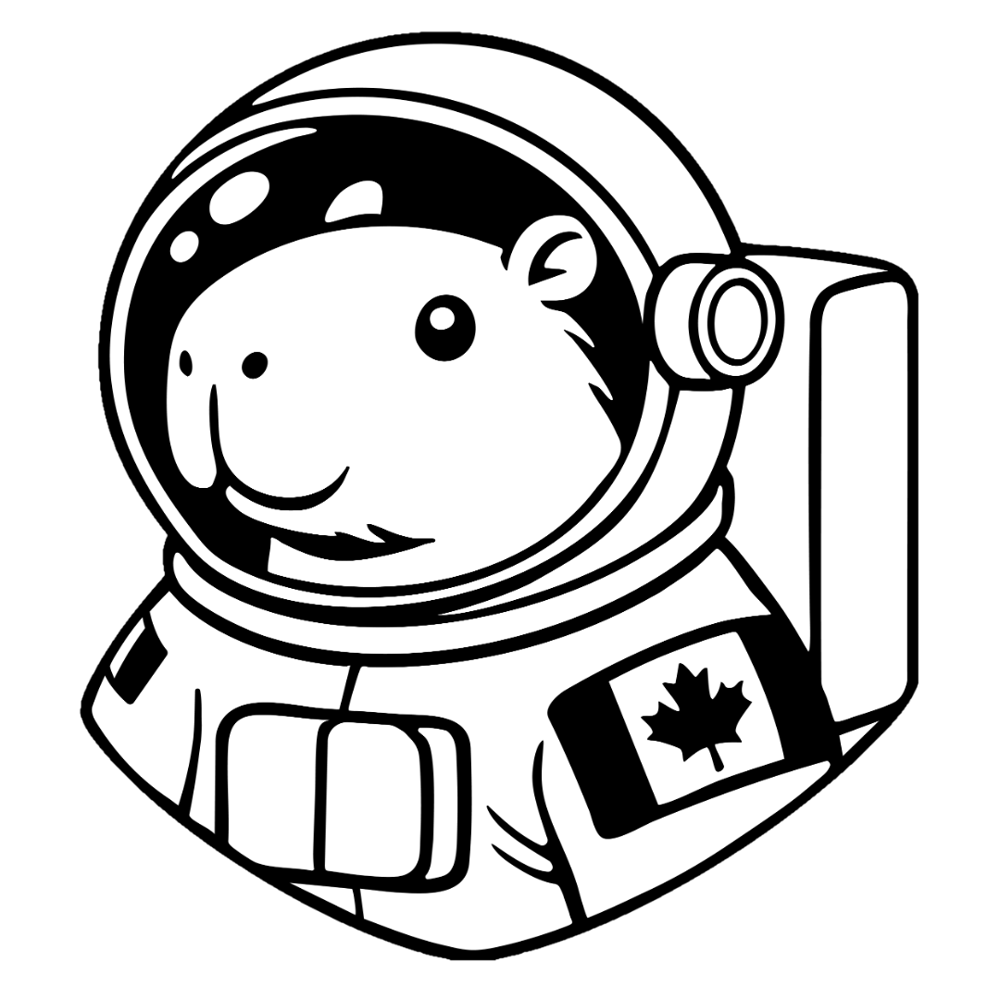

# RSX CanSat 2T5-2T6 Designs 

This repository contains all files created by the Aerial Team of the Robotics for Space eXploration (RSX) design team at the University of Toronto, supporting our entry in the 2026 CanSat Competition for the 2025-2026 design cycle.

**Competition Team Members:**
- Adam Kabbara | Team Lead
- Alexey Albert | Jr. Team Lead
- Arthur Goetzke-Coburn | Mechanical Team Lead
- Daniel Yu | Electrical Team Lead
- Luke Watson | Software Team Lead

**CanSat Competition:**
- 📅 June 4-7, 2026
- 📍 Monterey, Virginia, United States
- 🧑‍🚀 [American Astronautical Society (AAS)](https://cansatcompetition.com/winners.html)
- 📃 [Mission Document](CanSat_Mission_Guide_2026c.pdf)

**RSX CanSat 2T4-2T5**
- 🏆 2025 Competiton Results: [5th Place Internationally](https://cansatcompetition.com/winners.html)
- 💻 GitHub Repo: [RSX-CANSAT-2025](https://github.com/adam-kabbara/RSX-CANSAT-2025)

# 

  
  

  

