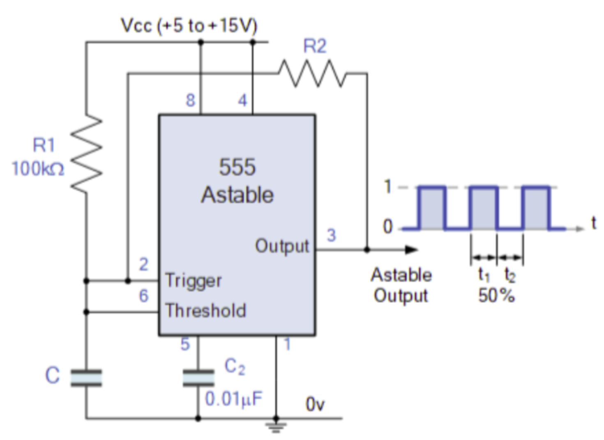
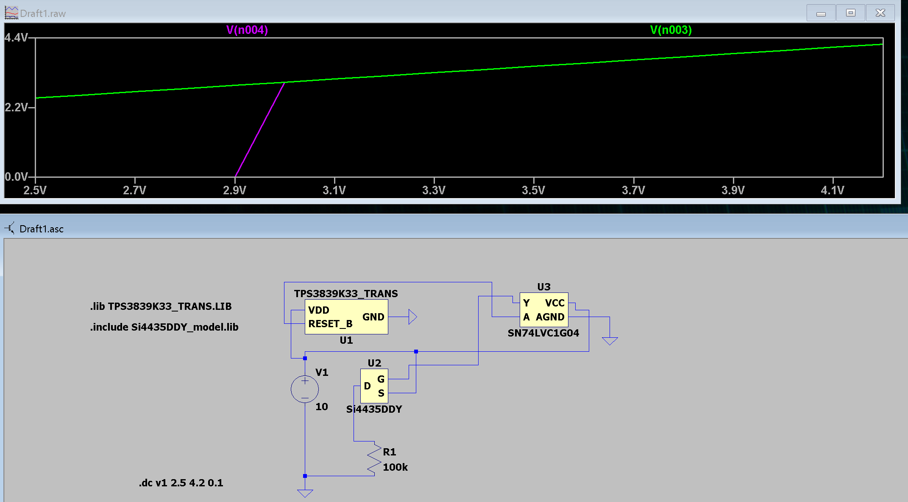
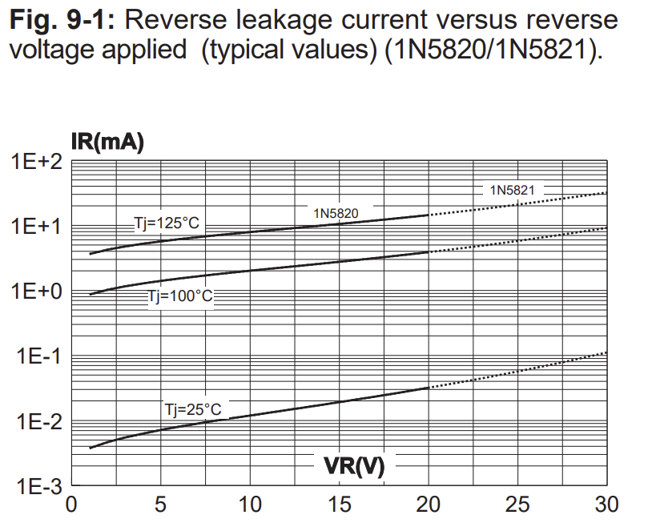
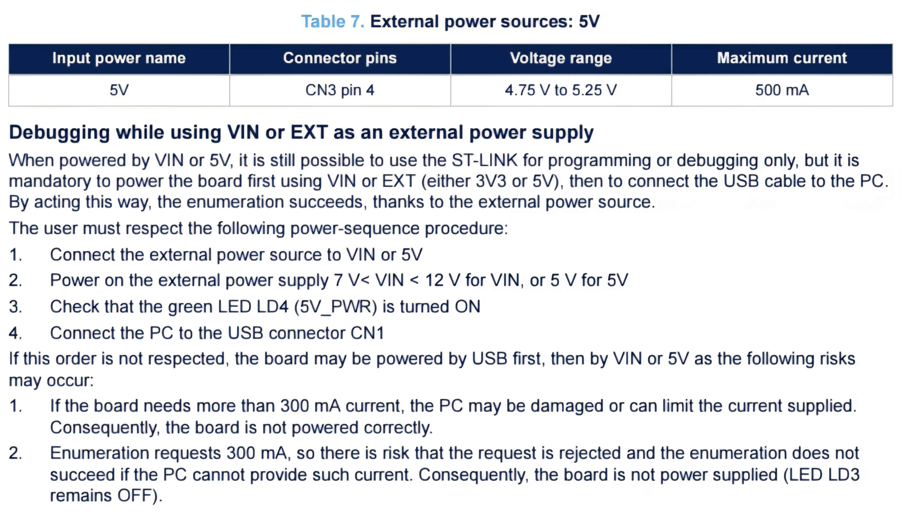

# Datasheets of electronic components
This folder contains datasheets of electronic components used in the project. This readme provides notes and highlights of the datasheets for quick reference.

## I2C Adress Book
- INA219 (A0, A1 are gnd on CPL): 0x40
- BMP581: 0x47 (can be changed to 0x46)
- BNO085: 0x4A (can be changed to 0x4B)
- MAXM10S: 0x42 
- VL53L1-SATEL​: 0x29

## I/O
### EEPROM
- Datasheet: [EEPROM.pdf](datasheets/EEPROM.pdf)
- Environment: CPL

### INA219
- Datasheet: [ina219.pdf](datasheets/ina219.pdf)
- Environment: Ground station and CPL
- Package: D ; using smd on cpl and adafruit on gnd station

## Power Electronics
### LT8610AB
- Datasheet: [LT8610AB.pdf](datasheets/LT8610AB.pdf)
- Environment: Ground station
- Details: 5v buck converter from 4s2p (16.8 to 12v) battery to 5v for the ground station. 5 volts used to power the raspberry pi and LED lights. Estimated current consumption to handel is 2.5A.

### LTC3114
- Datasheet: [LTC3114.pdf](datasheets/LTC3114.pdf)
- Environment: Ground station
- Details: 12v buckboost from 4s2p (16.8 to 12v) battery to 12v for the ground station. 12 volts used to power the monitor and speakers.
- Package: FE

### LTC3536
- Datasheet: [LTC3536.pdf](datasheets/LTC3536.pdf)
- Digikey: [LTC3536](https://www.digikey.com/en/products/detail/analog-devices-inc/LTC3536EMSE-PBF/2720693?s=N4IgTCBcDaIDIBUDCBmArCgbAUQLIGVsBiABQCEAxAWgDkAREAXQF8g)
- Environment: CPL
- Details: 3.3v buckboost from 1s (3.7v) battery to 3.3v for the sensors on the CPL. 
- Package: MSE

### MP3414
- Datasheet: [MP3414A.pdf](datasheets/MP3414A.pdf)
- Digikey: [MP3414A](https://www.digikey.com/en/products/detail/monolithic-power-systems-inc/MP3414AGJ-Z/7361472?s=N4IgTCBcDaIIwFYAcBOAtHAbAZgOwbQDkAREAXQF8g)
- Environment: CPL
- Details: 5.5v boost from 1s (3.7v) battery to 5.5v for the cameras, rtc clock and motors on the CPL.
- Node: To make use of the True Output Disconnect feature, the EN pin must be driven low. So **EN should be connected to Vin**. When battery connected, EN is high and the converter operates. When battery disconnected, EN is low and the converter is disabled and blocks current flow from the output to the input. 

### ~~MAX756CPA+~~
- ~~Datasheet: [max756.pdf](datasheets/max756.pdf)~~
- ~~Environment: CPL~~
- ~~Details: Two exist~~
    - ~~One is for 5v boost from 1s (1.2v) ni-mh battery to 5v for the buzzer circuit on the CPL.~~
    - ~~Another will be used for 5v boost from 1s (3.7v) battery to 5v for the STM on the CPL. This is to allow for power isolation between the STM and the sensors, so we can power the STM without powering the sensors for debugging.~~

- The max startup voltage too low for a NiMh. It does operate down to low voltages, but the startup voltage is higher than what would be reliable for a NiMh battery. Use a MCP1640 for buzzer instead. Can boost to either 5.0V (use NE555) or 3.3v (use TLC555)

### MCP1640
- Datasheet: [MCP1640.pdf](datasheets/MCP1640.pdf)
- Digikey: [MCP1640](https://www.digikey.ca/en/products/detail/microchip-technology/MCP1640T-I-CHY/2258569)
- Environment: CPL buzzer circuit
- Details: replace max756 for 5v boost from 1s (1.2v) ni-mh battery to 5v for the buzzer circuit on the CPL. The MCP1640 has a low startup voltage of 0.65v, which is suitable for a NiMh battery. We will use TLC555 for the oscillator in the buzzer circuit, which can operate at 3.3v instead of NE555.

# TODO LTSPICE BUZZER CICUIT 

### Low Voltage Cutoff (LVC) Circuit
The CPL has two low voltage cutoff circuits to ensure the batteries do not over discharge. The two circuits are very similar, but they use slightly different components.

Spice models have been created to simulate these LVCs and can be found in the [Spice folder](Spice/). R1 is just there to model our load. In the actual circuit, we will have that node connected to the Vin of our voltage converters.

1. Main battery ([21700 Li-ion](https://rotorgeeks.com/samsung-50e-5000mah-98a-21700-cell)) LVC:
    - Supervisor: [TPS3839K33](https://www.digikey.ca/en/products/detail/texas-instruments/TPS3839K33DBZR/3748986)
    - Inverter: [SN74LVC1G04](https://www.digikey.ca/en/products/detail/umw/SN74LVC1G04DBVR/16842214)
    - PMOSFET: [SI4435DDY](https://www.digikey.ca/en/products/detail/vishay-siliconix/SI4435DDY-T1-E3/2622193)

2. Buzzer battery ([Ni-MH](https://www.digikey.ca/en/products/detail/panasonic-energy/HHR-70AAAE4/597940)) LVC:
    - Supervisor: [TPS3839A09DBZR](https://www.digikey.ca/en/products/detail/texas-instruments/TPS3839A09DBZR/3900178)
    - Inverter: [SN74AUP1G04](https://www.digikey.ca/en/products/detail/texas-instruments/SN74AUP1G04DBVR/864075)
    - PMOSFET: [SI4435DDY](https://www.digikey.ca/en/products/detail/vishay-siliconix/SI4435DDY-T1-E3/2622193)

### Battery Info
As mentioned in the section above, we have two rechargable batteries on the CPL, a [samsung 50e 21700 li-ion](https://rotorgeeks.com/samsung-50e-5000mah-98a-21700-cell) as the main battery, and a [panasonic HHR-70AAAE4 ni-mh](https://www.digikey.ca/en/products/detail/panasonic-energy/HHR-70AAAE4/597940) as the buzzer battery. Below are some important notes about these batteries.
#### Samsung 50e 21700 Li-ion
- Datasheet: [samsung_50e.pdf](datasheets/samsung_50e.pdf)
- **Charge at 2450mA (~0.5C) at 4.2v**
- Nominal voltage: 3.63v
- Max voltage: 4.2v
- Min voltage: 3.0 (defined by us - technically can go down to 2.5v)
- Capacity: 5000mAh
#### Panasonic HHR-70AAAE4 Ni-MH
- Datasheet: [panasonic_hhr.pdf](datasheets/panasonic_hhr.pdf)
- **Standard charge at 70mA at 1.4v**
- **Rapid charge at 650mA at 1.4v**
- Nominal voltage: 1.2v
- Max voltage: 1.4v
- Min voltage: 1.1v (defined by us - technically can go down to ~<0.9v)
- Capacity: 700mAh
---

### General Notes
#### Power Isolation
To allow for debugging, the STM32 must be able to be powered without powering the sensors. To achieve this, we decide put the STM on a separate power rail from the sensors, so it will need a seperate boost (5v power option) or buckboost (3.3v power option) converter. We decide to go with 5v as we have an extra Max756CPA+ boost converter, which will be used to power the STM alone. To allow for debugging though, the sensors (and motors) must also be able to be powered without powering the STM. We need power isolation between all output rails. 

**We will assume that debugging always happens when the battery is disconnected (and has been for a couple seconds) and power is supplied to the stm through the usb, while power is supplied to the sensors and motors at the Vout nodes of the 3.3v and 5.5v converters.** 

No voltage should be present at the Vin terminals of the converters this **WILL** break stuff. So do not connect power to where the battery was connected, you must provide power to the sensors and motors using an external power supply connected to the test points on the PCB.

Below is the thought process for the power isolation design.

**MP3414A**:
- Synchronous boost with true output disconnect via internal PMOS. Actively blocks body diode conduction in shutdown according to datasheet.
- For this to work **EN must be tied to Vin**, that way when Vin is disconnected from the battery, EN is low and the converter is disabled and blocks current flow from the output to the input. When battery is connected, EN is high and the converter operates as normal.

**LTC3536**:
- 4-switch synchronous buck-boost with a direct reverse path while running
- If EN is high while Vout was driven, it has a reverse current limit (0.55A) to protect itself, but doesn't fully prevent backflow. We should NOT rely on this feature to prevent backflow, we should make sure converter is disabled when battery is disconnected.
- SHDN (shutdown) pin is active-high, so **tie SHDN to VIN**. Allows converter to operate when battery is connected, and disables it when battery is disconnected while preverting backflow.

**Max756CPA+**:
- Asynchronous boost with external discrete 1N5822 Schottky
- Schottky provides hard reverse blocking
- Reverse current at our expected voltage and temperatures is negligible.
 

To ensure Vin is truely discharged while debugging, we will add a solder bridge across, from Vin to a pull down resistor to GND. This resistor must be a through hole (estimated value of 3.3kΩ) to ensure fast discharge of Vin when battery is disconnected. This will mean we will lose some current through the resistor, we may have to tune this value. **The solder bridge must only be connected while testing, it should be disconnected during normal operation.**

---

#### Board debugging procedure
There are two actors that require processing before board debugging. Follow in the order below:
1. Power isolation must be ensured as discussed in the previous section. To do this:
    - Disconnect battery and connect the solder bridge, ensuring Vin is pulled to ground through the pull down resistor.
    - Using a multimeter, verify that there is no voltage at the Vin terminals of the converters.
    - Provide power to the sensors via external power supply connected to the 3.3v and GND test point on the PCB.
    - Provide power to the motors and cameras via external power supply connected to the 5.5v and GND test point on the PCB.
    - Provide power to the STM via external power supply connected to the 5v and GND test point on the PCB. 
    - Now you can move to STM debugging setup sequence.
2. The STM must follow a specific power up sequence.
